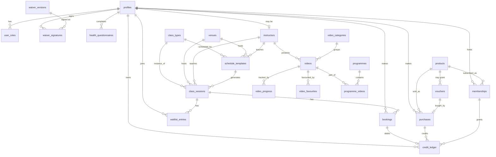

# Data model (M0 proposal)

Postgres via Supabase. Every table gets RLS. Conventions:

- `uuid` primary keys (`gen_random_uuid()`), `created_at`/`updated_at` on mutable tables.
- All timestamps `timestamptz`, stored UTC. Class times authored in `Europe/London`.
- **All money is `integer` pence.** Never `float`, never `numeric` for prices.
- Soft-delete via `deleted_at` only where we must keep history; otherwise hard delete.
- `profiles.id` is a FK to `auth.users.id`.

---

## ERD

---

## Tables

### Identity, roles, consent

| Table | Key columns | Notes |
|---|---|---|
| `profiles` | `id`→auth.users, `first_name`, `last_name`, `email`, `phone`, `date_of_birth`, `emergency_contact_name`, `emergency_contact_phone`, `marketing_consent`, `marketing_consent_at`, `stripe_customer_id`, `anonymised_at` | `email`/`phone` also stored normalised for intro-offer dedupe |
| `user_roles` | `user_id`, `role` (`admin`\|`instructor`\|`member`) | **Separate table on purpose.** If role lived on `profiles`, a member with update rights on their own row could promote themselves to admin. No member-writable policy here at all. |
| `instructors` | `profile_id?`, `display_name`, `bio`, `photo_path`, `qualifications[]`, `active`, `sort_order` | Nullable `profile_id` so Kelly can list a cover teacher before they have a login |

### Waiver and health

| Table | Key columns | Notes |
|---|---|---|
| `waiver_versions` | `version_label`, `body_markdown`, `body_sha256`, `published_at`, `published_by`, `is_current` | Partial unique index enforces one `is_current`. Publishing a new version forces re-sign at next booking. |
| `waiver_signatures` | `user_id`, `waiver_version_id`, `typed_name`, `signature_image_path`, `signed_at`, `ip_address`, `user_agent`, `pdf_path` | **Immutable** — trigger blocks UPDATE/DELETE. This is the legal record; every historical signature is kept. Storing the version's `body_sha256` means we can prove exactly what text was agreed. |
| `health_questionnaires` | `user_id`, `answers` jsonb, `flagged`, `pregnancy_status`, `pregnancy_weeks`, `injuries_text`, `explicit_consent_at`, `completed_at`, `valid_until`, `review_state`, `reviewed_by` | **UK GDPR special category data.** Readable only by `admin`/`instructor`, enforced in RLS not UI. `valid_until` = completed_at + 12 months drives re-prompting. Any "yes" sets `flagged` — flags for Kelly to review, never auto-blocks. |

### Schedule

| Table | Key columns | Notes |
|---|---|---|
| `venues` | `name`, `slug`, address fields, `postcode`, `lat`, `lng`, `timezone`, `parking_notes`, `access_notes`, `photo_paths[]`, `default_capacity`, `active` | One page each for local SEO |
| `class_types` | `name`, `slug`, `description`, `long_description`, `level`, `intensity`, `default_duration_mins`, `colour_token`, `hero_image_path`, `what_to_bring`, `active` | `colour_token` names a semantic token, not a hex |
| `schedule_templates` | `class_type_id`, `venue_id`, `instructor_id`, `weekday` 0-6, `start_time_local`, `duration_mins`, `capacity`, `effective_from`, `effective_to?`, `active` | The recurring rule. `effective_to` lets Kelly retire a slot without deleting its history. |
| `class_sessions` | `template_id?`, `class_type_id`, `venue_id`, `instructor_id`, `starts_at`, `ends_at`, `capacity`, `status` (`scheduled`\|`cancelled`), `note`, `is_one_off`, `price_override_pence?`, `cancelled_at`, `cancelled_reason` | Concrete instance. Individually editable. `UNIQUE(template_id, starts_at)` makes the generator idempotent — re-running the cron can't duplicate. `is_one_off` covers workshops and pop-ups with their own price. |

> **Deliberately not stored:** a `booked_count` column. It would be a second source of truth
> that can drift from `bookings`. Capacity checks count rows inside the locked transaction;
> read paths use a view.

### Booking

| Table | Key columns | Notes |
|---|---|---|
| `bookings` | `session_id`, `user_id`, `status` (`booked`\|`attended`\|`no_show`\|`cancelled_in_window`\|`cancelled_late`), `booked_at`, `cancelled_at`, `checked_in_at`, `source` (`member`\|`admin`\|`walk_in`\|`waitlist`), `entitlement_kind`, `ledger_entry_id?`, `purchase_id?` | Partial unique index `(session_id, user_id) WHERE status IN ('booked','attended')` prevents double-booking |
| `waitlist_entries` | `session_id`, `user_id`, `position`, `joined_at`, `status` (`waiting`\|`promoted`\|`notified`\|`left`), `promoted_at`, `notified_at` | Position derived from `joined_at` so it self-heals when someone leaves |

### Money

| Table | Key columns | Notes |
|---|---|---|
| `products` | `kind` (`drop_in`\|`intro_offer`\|`pack`\|`membership`\|`on_demand`\|`voucher`), `name`, `slug`, `price_pence`, `credits?`, `validity_days?`, `billing_interval?`, `credits_per_period?`, `rollover_cap?`, `is_unlimited`, `max_bookings_per_day?`, `includes_on_demand`, `stripe_product_id`, `stripe_price_id`, `active`, `sort_order` | One table covers all product kinds; `kind` gates which columns apply (CHECK constraints) |
| `purchases` | `user_id`, `product_id`, `stripe_checkout_session_id`, `stripe_payment_intent_id`, `amount_pence`, `discount_pence`, `promo_code?`, `voucher_id?`, `status`, `purchased_at`, `refunded_at` | |
| `credit_ledger` | `user_id`, `delta` int, `kind`, `reason?`, `expires_at?`, `purchase_id?`, `session_id?`, `booking_id?`, `admin_id?`, `created_at` | **Append-only, trigger-enforced.** Balance = `SUM(delta) WHERE expires_at IS NULL OR expires_at > now()`. See §Invariants. |
| `memberships` | `user_id`, `product_id`, `stripe_subscription_id`, `status`, `current_period_start`, `current_period_end`, `cancel_at_period_end`, `grace_until?` | `grace_until` is what blocks booking after failed payment + dunning |
| `vouchers` | `code` unique, `kind` (`monetary`\|`pack`), `value_pence?`, `product_id?`, `purchaser_user_id`, `recipient_email`, `recipient_name`, `message`, `send_at`, `sent_at`, `redeemed_by?`, `redeemed_at?`, `expires_at` | Cron sends on `send_at` |
| `promo_codes` | `code`, `stripe_promotion_code_id`, display fields | Stripe Coupons do the work; this mirrors them for admin display |
| `intro_offer_claims` | `user_id`, `email_normalised`, `phone_normalised`, `card_fingerprint?`, `claimed_at` | Unique index on each of the three columns independently — that's what blocks acceptance test 2 |
| `stripe_events` | `id` (Stripe event id, PK), `type`, `payload`, `processed_at` | Idempotency guard |

### Video

`video_categories`, `videos` (`mux_asset_id`, `mux_playback_id`, `duration_secs`, `level`,
`equipment[]`, `safe_for_pregnancy`, `safety_note`, `publish_at`, `published`),
`video_progress` (`user_id`, `video_id`, `position_secs`, `completed_at`),
`video_favourites`, `programmes`, `programme_videos`, `programme_progress`,
and `live_streams` — **a stub table only**, so Mux Live can be added later without a migration
that touches `videos`.

### Operations

| Table | Notes |
|---|---|
| `settings` | `key` PK, `value` jsonb. The single home for cancellation window, penalties, booking window, waitlist cutoff, reminder offsets, rollover rules, intro-offer rules, VAT display. Read via `/lib/policy`. |
| `notifications` | Every queued/sent email and SMS: `user_id`, `template`, `channel`, `payload`, `scheduled_for`, `sent_at`, `provider_message_id`, `status`. Also the dedupe guard — a unique key per (user, template, subject id) stops double reminders when a cron run overlaps. |
| `enquiries` | Private/events/contact inbox with `status` |
| `audit_log` | `actor_id`, `action`, `entity`, `entity_id`, `before`, `after`. Every admin mutation. |
| `faqs`, `announcements` | Admin-editable content |
| `reviews` | Imported Google reviews. **Never seeded with fabricated testimonials** — the homepage renders an empty state until real ones exist. |
| `newsletter_subscribers` | `email`, `consent_at`, `source`, `synced_at`, `provider_id` |

---

## Invariants

These are the properties tests exist to defend:

1. **Capacity** — active bookings for a session never exceed `class_sessions.capacity`.
   Enforced by `SELECT ... FOR UPDATE` on the session row inside `book_session()`.
2. **Ledger immutability** — `credit_ledger` admits only INSERT. Balance is always derived,
   never stored.
3. **FIFO expiry** — a booking debits the unexpired credit with the soonest `expires_at`.
4. **Refund preserves expiry** — `cancel_refund` carries the original credit's `expires_at`,
   so cancelling can't be used to extend a pack.
5. **Fulfilment is webhook-only** — no code path outside a verified webhook handler inserts
   a `purchase` or a `membership_grant`.
6. **Webhook idempotency** — a Stripe event id already in `stripe_events` is acknowledged
   and ignored.
7. **Booking gate** — current waiver signed + PAR-Q complete + within booking window +
   entitlement or payment. Checked server-side in the RPC, never only in the UI.
8. **Health data isolation** — no RLS policy grants the `member` role SELECT on
   `health_questionnaires` beyond their own row; the free-text fields are admin/instructor only.
9. **Policy text matches policy logic** — member-facing cancellation copy is rendered from
   the same `settings` rows the enforcement reads.
10. **Session generation is idempotent** — `UNIQUE(template_id, starts_at)`; the cron can run
    twice without duplicating a class.

---

## RLS sketch

| Role | Can read | Can write |
|---|---|---|
| anon | `class_types`, `venues`, `class_sessions` (scheduled, future), `products` (active), `faqs`, `announcements`, `reviews`, `waiver_versions` (current body, so it's readable before sign-up) | `enquiries` insert (rate-limited), `newsletter_subscribers` insert |
| member | own `profiles`, `bookings`, `waitlist_entries`, `credit_ledger`, `purchases`, `memberships`, `waiver_signatures`, own `health_questionnaires` row, `videos` (published, gated by entitlement) | own `profiles` (not role, not `stripe_customer_id`); bookings only via RPC |
| instructor | members booked onto **their own** sessions, incl. PAR-Q flags for those members | attendance marks on their own sessions |
| admin | everything | everything, through audited server actions |

Mutations go through Server Actions or RPCs with Zod validation and an explicit server-side
authorisation check. RLS is the backstop, not the only line of defence.
